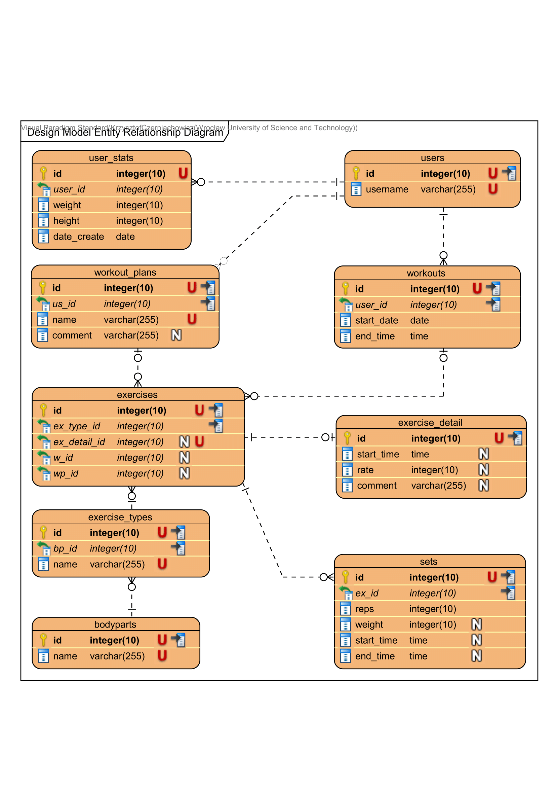

# gym-journal
A workout tracking application built as a hobby education project in Java.  
As a challenge, it is developed entirely in **core Java 8**, without an ORM.  
SQLite was chosen as the database for being **lightweight, self-contained, and serverless**

## Use Cases
### Workout Logging
- Select exercise
- Input sets, reps, weight
- Add comments & rate session

### Exercise Management
- Add new exercise (name, target body part)

### Workout Planning
- Create & save structured workout plans

### Workout History
- View past workouts (date, exercises, load)
- Track total workouts in a given period
- Analyze total load per body part

### Detailed Workout View
- Breakdown of exercises (name, reps, weight)
- Total load per exercise & body part
- Workout duration & set details

### User Statistics
- Track weight, height, BMI
- Log body measurements (circumference)
- Monitor personal records & progress over time

## Database project
